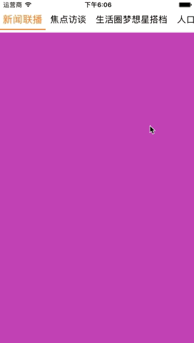
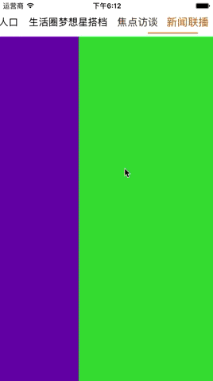

# XZMenuView
[](#)
[](https://www.apache.org/licenses/LICENSE-2.0.html)
[](#)

## 特色 Feature
1. 自适应当前 App 排版方向。Auto adjusts user interface layout direction
2. 渐变的过渡效果。Transition effect.

## 演示 Demo
1. 从左到右排版。 Left To Right Layout Direction<br>
 

2. 从右到左到排版。 Right To Left Layout Direction<br>
 

## 安装。 Install
### 中文
1. 将 cocoapods 更新至最新版本。
2. 在 Podfile 中添加 `pod 'XZMenuView'`。
3. 执行 `pod install` 或 `pod update`。
4. 导入 `XZMenuView.h`。

### 英文
1. Update your cocoapods to latest version.
2. Add `pod 'XZMenuView'` to your Podfile.
3. Run `pod install` or `pod update` in terminal.
4. Import `XZMenuView.h` and user.

## 代码示例。 How to use

### 自定义菜单视图。Customlize menu item view
1. XZMenuView 不提供任何样式的菜单，开发者完全可自定义所需的样式。
2. 在自定义视图中实现 \<XZMenuItemView\> 协议，可以接收一些基本事件，如selected、hightlighted、transiting。
3. 自定义视图是通过类似 UITableView 的数据源方式提供给 XZMenuView 的，并且是复用的。
4. 针对纯文本的菜单，提供了 XZPlainMenuItemView 视图，以满足一般情况下的需求，也可以对它继承，实现不同风格的菜单，如 Demo 中的 MenuItemView  就是一个例子。

````Objective-C
// `XZPlainMenuItemView` is an example for pure text menu. You can use it directly or subclassing of it.
// The setter of property `transition` will receive the transition value when the view needs show a transition appearance.
// See `XZPlainMenuItemView` for more detail.
````

### 使用
````Objective-C
// 1. 创建。create
self.menuView = [[XZMenuView alloc] initWithFrame:frame];
self.menuView.delegate = self;
self.menuView.dataSource = self;
self.menuView.indicatorStyle = XZMenuViewIndicatorStyleDefault;
self.menuView.indicatorPosition = XZMenuViewIndicatorPositionBottom;
self.menuView.indicatorColor = [UIColor orangeColor];
[self.view addSubview:self.menuView];
    
// 实现数据源。dataSource
- (NSInteger)numberOfItemsInMenuView:(XZMenuView *)meunView {
  return self.menuItems.count;
}

- (UIView *)menuView:(XZMenuView *)menuView viewForItemAtIndex:(NSInteger)index reusingView:(__kindof UIView *)reusingView {
    XZPlainMenuItemView *menuItemView = (XZPlainMenuItemView *)reusingView;
    if (menuItemView == nil) {
        menuItemView = [[XZPlainMenuItemView alloc] initWithTransitionOptions:XZTextMenuItemViewTransitionOptionScale | XZTextMenuItemViewTransitionOptionColor];
        [menuItemView setTextColor:[UIColor darkTextColor] forState:(UIControlStateNormal)];
        [menuItemView setTextColor:[UIColor orangeColor] forState:(UIControlStateSelected)];
    }
    
    NSString *menuItem = [self menuItems][index];
    menuItemView.textLabel.text = menuItem;
    
    return menuItemView;
}
````


## 渐变的过渡效果。Transiting animation.
1. XZMenuView 观察视图的位置来决定过渡的进度，而且仅仅需要做的就是告诉 XZMenuView 过渡什么时候开始、什么时候结束。
2. 通过 -[XZMenuView beginTransition:] 方法告知 XZMenuView 过渡开始了，且状态是从哪一个视图开始。
3. 在过渡完成的时候，调用 -[XZMenuView endTransition] 通知 XZMenuView 过渡已完成。
4. 在过渡中，XZMenuView 会计算进度，并将状态传递给 Menu Item View 。

````Objective-C
// 一个在使用 `UIPageViewController` 时实现 XZMenuView 过渡效果的例子。If you use the `UIPageViewController` you may just do like this.
- (void)pageViewController:(UIPageViewController *)pageViewController willTransitionToViewControllers:(NSArray<UIViewController *> *)pendingViewControllers {
    [self.menuView beginTransition:[self viewControllerAtPage:self.menuView.selectedIndex].view]; // transition beigins
}

- (void)pageViewController:(UIPageViewController *)pageViewController didFinishAnimating:(BOOL)finished previousViewControllers:(NSArray<ContentViewController *> *)previousViewControllers transitionCompleted:(BOOL)completed {
    [self.menuView endTransition]; // transition ended.
    if (finished && completed) {
        NSInteger currentPage = [self pageOfViewController:pageViewController.viewControllers.lastObject];
        [self.menuView setSelectedIndex:currentPage animated:YES];
    }
}
````

## 系统要求
==============
该库最低支持 `iOS 7.0` 和 `Xcode 7.0`。

## 许可证
==============
XZTheme 使用 MIT 许可证，详情见 LICENSE 文件。


## The CocoaPods Master Repo

This repository contains the public [CocoaPods](https://github.com/CocoaPods/CocoaPods) specifications.

## Links

- [Specs and the Specs Repo](http://guides.cocoapods.org/making/specs-and-specs-repo.html): Learn about creating Podspec's and the Spec repo.
- [Getting setup with Trunk](http://guides.cocoapods.org/making/getting-setup-with-trunk.html): Instructions for creating a CocoaPods user account


## License

These specifications and CocoaPods are available under the [MIT license](http://www.opensource.org/licenses/mit-license.php).


